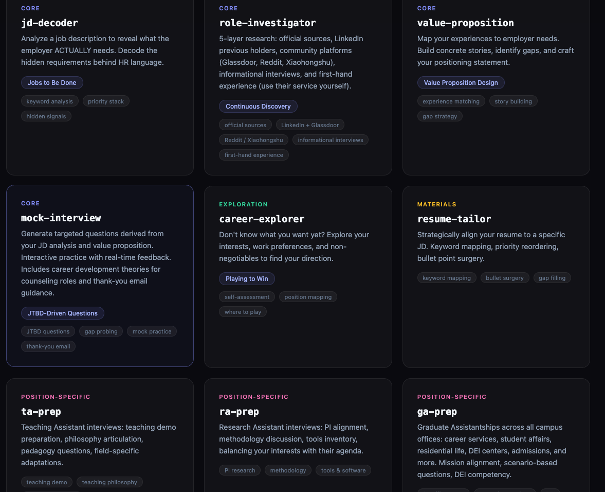
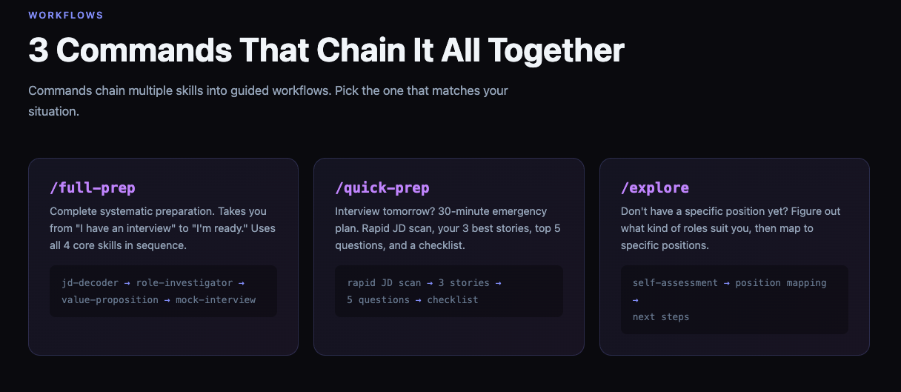

# Interview Prep Skills

Systematic interview preparation skills for university students (undergrad, master's, PhD). Uses product thinking frameworks (JTBD, Value Proposition Design, Continuous Discovery, Playing to Win) applied to interview prep.





## Core Skills

| Skill | What it does | Framework |
|---|---|---|
| **jd-decoder** | Analyze a job description to reveal the employer's real needs | Jobs to Be Done (JTBD) |
| **role-investigator** | Systematic research: official sources → LinkedIn → community → interviewer profiling | Continuous Discovery |
| **value-proposition** | Map your experiences to employer needs, build stories, create positioning statement | Value Proposition Design |
| **mock-interview** | Generate targeted questions + interactive mock practice with feedback | — |

## Exploration & Materials

| Skill | What it does | Framework |
|---|---|---|
| **career-explorer** | Help students who don't know what they want figure out their direction | Playing to Win (Where to Play) |
| **resume-tailor** | Strategically align a resume/CV to a specific job description | — |
| **thank-you-note** | Write effective post-interview thank-you emails | — |

## Position-Specific Deep Dives

| Skill | For | Unique elements |
|---|---|---|
| **ta-prep** | Teaching Assistant positions | Teaching demo prep, teaching philosophy, pedagogy questions |
| **ra-prep** | Research Assistant positions | PI research alignment, methodology discussion, tools inventory |
| **ga-prep** | Graduate Assistantships (student services) | Mission alignment, scenario-based questions, DEI competency, career development theories |
| **internship-prep** | Industry internships | Multi-stage process, "Why this company?", STAR method, potential-over-experience framing |

## Commands (Chained Workflows)

| Command | What it does |
|---|---|
| **/full-prep** | Complete systematic preparation: jd-decoder → role-investigator → value-proposition → mock-interview |
| **/quick-prep** | Emergency mode for interviews tomorrow: rapid JD scan → 3 stories → 5 questions → checklist |
| **/explore** | Career exploration: self-assessment → position mapping → next steps |

## How to use

Install as Claude Code skills by pointing to the individual skill directories, or use the commands for guided workflows.

**Typical journey:**
1. Don't know what to apply for? → `/explore`
2. Found a posting? → `jd-decoder` → `role-investigator` → `resume-tailor`
3. Got an interview? → `/full-prep` (+ position-specific skill like `ta-prep` or `ga-prep`)
4. Interview tomorrow? → `/quick-prep`
5. Interview done? → `thank-you-note`

## Design philosophy

These skills teach **methods, not answers**. Instead of giving students generic tips they can find anywhere, we teach frameworks they can reuse for every future interview:

1. **JTBD**: Understand what the employer actually needs (not what the JD says)
2. **Continuous Discovery**: Research systematically — official sources, LinkedIn, community platforms, informational interviews
3. **Value Proposition Design**: Match your specific experiences to their specific needs with concrete stories
4. **Playing to Win**: Figure out where to focus your energy before competing
5. **Targeted practice**: Questions derived from analysis, not a generic question bank

## Architecture

```
interview-prep-skills/
├── career-explorer/SKILL.md      ← Career direction exploration (Where to Play)
├── jd-decoder/SKILL.md           ← Decode job descriptions (JTBD)
├── role-investigator/SKILL.md    ← Systematic role research (Continuous Discovery)
├── resume-tailor/SKILL.md        ← Strategic resume alignment
├── value-proposition/SKILL.md    ← Experience-to-needs matching
├── mock-interview/SKILL.md       ← Mock interview + feedback
├── thank-you-note/SKILL.md       ← Post-interview follow-up
├── ta-prep/SKILL.md              ← Teaching Assistant specialization
├── ra-prep/SKILL.md              ← Research Assistant specialization
├── ga-prep/SKILL.md              ← Graduate Assistantship (all campus offices)
├── internship-prep/SKILL.md      ← Industry internship specialization
└── commands/
    ├── full-prep.md              ← Complete preparation workflow
    ├── quick-prep.md             ← Emergency prep mode
    └── explore.md                ← Career exploration workflow
```

## Acknowledgments

The architecture and framework selection for this project were inspired by [PM Skills Marketplace](https://github.com/phuryn/pm-skills) by Paweł Huryn. Their approach of applying product thinking frameworks (JTBD, Value Proposition Design, Continuous Discovery Habits, Playing to Win) through structured, interactive AI skills directly influenced how we designed this interview prep ecosystem. We adapted these product strategy frameworks to the domain of interview preparation for university students.

The frameworks themselves are based on the work of:
- Anthony W. Ulwick — *Jobs to Be Done*
- Strategyzer — *Value Proposition Design*
- Teresa Torres — *Continuous Discovery Habits*
- Roger L. Martin — *Playing to Win*
